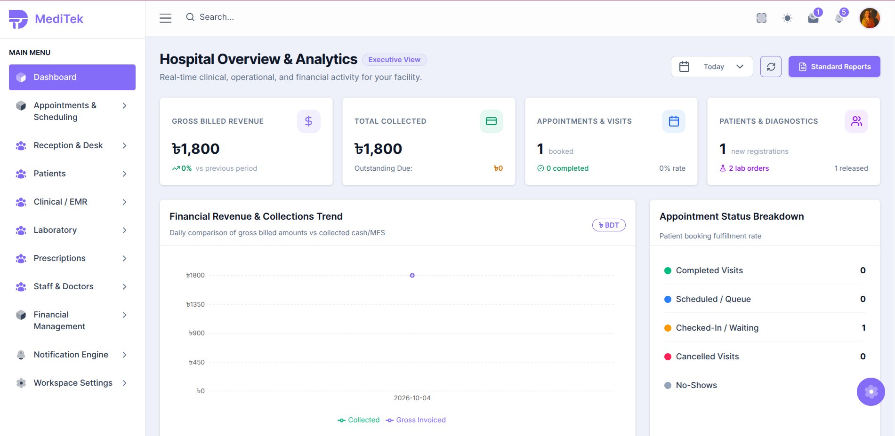
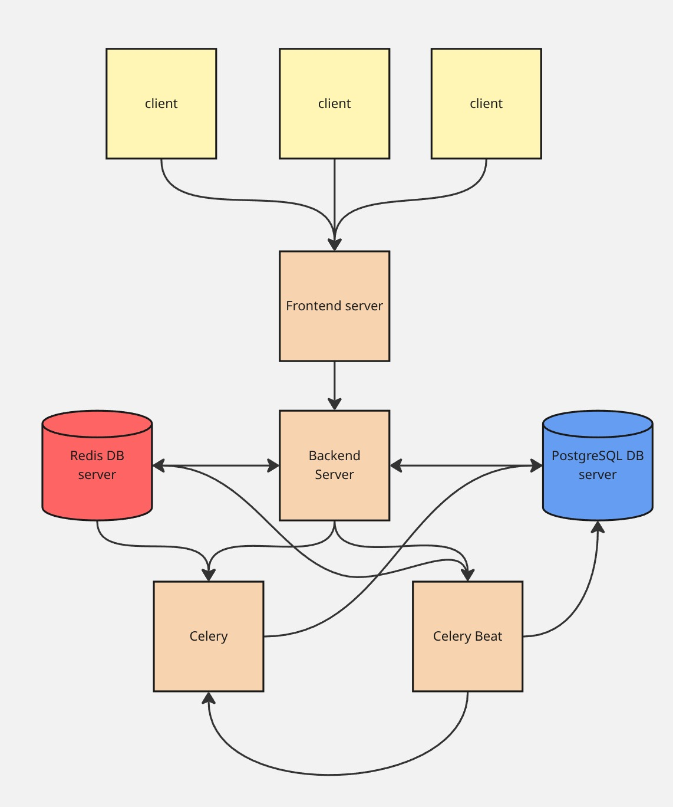

# MEDITek — Frontend

> A multi-tenant SaaS clinic & hospital management platform — giving Bangladesh's healthcare facilities a complete digital command center to manage patients, clinical records, billing, labs, and staff from a single, secure dashboard.

[🌐 Live Demo](https://meditek-frontend-cpy.vercel.app/) · [📦 Backend Repo](https://github.com/salauddin85/pepoltek_meditek_backend)



---

## Problem

Bangladesh's hospitals and diagnostic centers still rely on paper registers, disconnected spreadsheets, and siloed software — leading to lost patient records, billing errors, and zero cross-branch visibility. Existing solutions are either too expensive for small clinics or too generic to handle Bangladesh-specific workflows (BDT billing, Bangla locale, bKash/Nagad payments, SSLCommerz gateway).

## Solution & Key Features

- **Multi-Tenant Workspace**: Each hospital/clinic gets a fully isolated subdomain (`slug.meditek.com`) — zero data leakage between tenants
- **Patient & Appointment Management**: Complete patient registry with family linking, smart scheduling, walk-in queue display, and OPD token generation
- **Clinical / EMR Module**: Structured encounter documentation, vitals, ICD-10 diagnosis, allergy records, and clinical attachments with a full immutable audit trail
- **Prescription Management**: Drug master with interaction checks, reusable templates, and one-click print
- **Laboratory Module**: Lab order creation, sample tracking, manual result entry, critical value alerts, and PDF report generation
- **Financial Management**: Invoice generation, SSLCommerz + bKash/Nagad payment collection, and doctor revenue-share statements
- **Role-Based Access Control**: 15+ system roles (Doctor, Nurse, Receptionist, Cashier, Lab Tech, Pharmacist, etc.) with branch/department-scoped permissions
- **Real-time Queue Display**: WebSocket-powered public TV queue screen for OPD waiting rooms
- **Bangla + English Bilingual UI**: Full locale support with DD/MM/YYYY dates and BDT (৳) currency

## Architecture



**Key Decisions**

- **Next.js 16 App Router** with JavaScript — fast routing with server components for initial load performance
- **Zustand v5** for lightweight client state — auth store holds user/tenant/permissions; JWT tokens live exclusively in httpOnly cookies (never in JS memory)
- **Axios interceptor** auto-refreshes expired access tokens (15-min lifetime) transparently on 401, then retries the original request
- **Subdomain-based tenant resolution** — `xyz.meditek.com` resolved by backend middleware; frontend reads tenant context from the API response
- **Radix UI + shadcn/ui primitives** — accessible headless components styled with Tailwind CSS v4 design tokens
- **Recharts** for live financial and operational dashboards with real-time data polling

## Tech Stack

| Layer | Technology |
|---|---|
| Framework | Next.js 16 (App Router), React 19 |
| Styling | Tailwind CSS v4, shadcn/ui, Radix UI |
| State Management | Zustand v5 |
| Forms & Validation | React Hook Form + Zod |
| HTTP Client | Axios (with auth interceptor) |
| Charts | Recharts |
| Animation | Framer Motion |
| Drag & Drop | dnd-kit |
| Date Utilities | date-fns |
| Notifications | Sonner, React Hot Toast |
| Icons | Lucide React, Iconify |
| Deployment | Vercel |

## Project Structure

```
src/
├── app/
│   ├── (auth)/              # Login, register, OTP flows
│   ├── (dashboard)/         # Protected clinical workspace
│   │   └── dashboard/
│   │       ├── clinical/    # EMR encounters, vitals, notes
│   │       ├── finance/     # Invoices, payments, reports
│   │       ├── laboratory/  # Lab orders, results, reports
│   │       ├── notifications/
│   │       ├── patients/    # Patient registry & profile
│   │       ├── prescriptions/
│   │       ├── reception/   # Token desk & walk-in queue
│   │       ├── reports/     # Analytics & exports
│   │       ├── scheduling/  # Appointments & slots
│   │       ├── settings/    # Workspace configuration
│   │       └── staff/       # Doctors & employees
│   ├── (main)/              # Marketing / landing pages
│   ├── admin_dashboard/     # Platform Super Admin control plane
│   ├── portal/              # Patient self-service portal
│   └── queue-display/       # Public TV queue display screen
├── components/              # Shared UI components
├── config/                  # API routes & constants
├── hooks/                   # Custom React hooks
├── lib/                     # API client, auth utilities
├── provider/                # Context providers
└── store/                   # Zustand global stores
```

## Getting Started

### Prerequisites

- Node.js 20+
- A running instance of the [MEDITek Backend](https://github.com/pepoltek/pepoltek_meditek_backend)

### Installation

```bash
git clone https://github.com/pepoltek/meditek_frontend.git
cd meditek_frontend

npm install

cp .env.example .env.local
# Edit .env.local with your backend API URL
```

### Environment Variables

```env
NEXT_PUBLIC_API_URL=http://localhost:8000
NEXT_PUBLIC_WS_URL=ws://localhost:8000
```

### Run Development Server

```bash
npm run dev
```

App: [http://localhost:3000](http://localhost:3000)

### Build for Production

```bash
npm run build
npm start
```

## Demo Credentials

| Role | Email | Password |
|---|---|---|
| Hospital Admin | `demo@meditek.com` | `demo1234` |
| Doctor | `doctor@meditek.com` | `demo1234` |
| Receptionist | `reception@meditek.com` | `demo1234` |

> 🔗 Live at [meditek-frontend-cpy.vercel.app](https://meditek-frontend-cpy.vercel.app/)

## Key Pages

| Route | Description |
|---|---|
| `/` | Marketing landing page |
| `/register` | Multi-step SaaS onboarding wizard |
| `/dashboard` | Hospital overview & analytics |
| `/dashboard/patients` | Patient registry & profile |
| `/dashboard/scheduling` | Appointment scheduling & slots |
| `/dashboard/reception` | Token desk & walk-in queue |
| `/dashboard/clinical` | EMR encounters & notes |
| `/dashboard/prescriptions` | Drug master & prescriptions |
| `/dashboard/laboratory` | Lab orders & results |
| `/dashboard/finance` | Invoices & payment collection |
| `/dashboard/reports` | Analytics & custom reports |
| `/dashboard/staff` | Doctors & employees |
| `/dashboard/settings` | Workspace configuration |
| `/portal` | Patient self-service portal |
| `/queue-display` | Public TV queue display |
| `/admin_dashboard` | Platform Super Admin control plane |

## Linting

```bash
npm run lint
```

## Roadmap

- [x] Authentication (JWT + httpOnly cookies)
- [x] Patient Management
- [x] Appointment & Scheduling
- [x] Reception & Token Desk
- [x] Clinical / EMR
- [x] Prescription Management
- [x] Laboratory Module
- [x] Financial Management & Billing
- [x] Dashboard & Analytics
- [x] Notification Engine
- [x] Staff & Doctor Management
- [x] Patient Portal
- [x] Queue Display (WebSocket real-time)
- [x] Platform Super Admin Dashboard
- [ ] Pharmacy Management UI
- [ ] Inpatient (IPD) Module UI
- [ ] Operation Theater UI
- [ ] Emergency Module UI
- [ ] Telemedicine (Video Consult) — Phase 4
- [ ] Mobile App (React Native)

## Author

**Antu Saha** · [LinkedIn](https://www.linkedin.com/in/antusaha970/) · antusaha.dev@gmail.com
